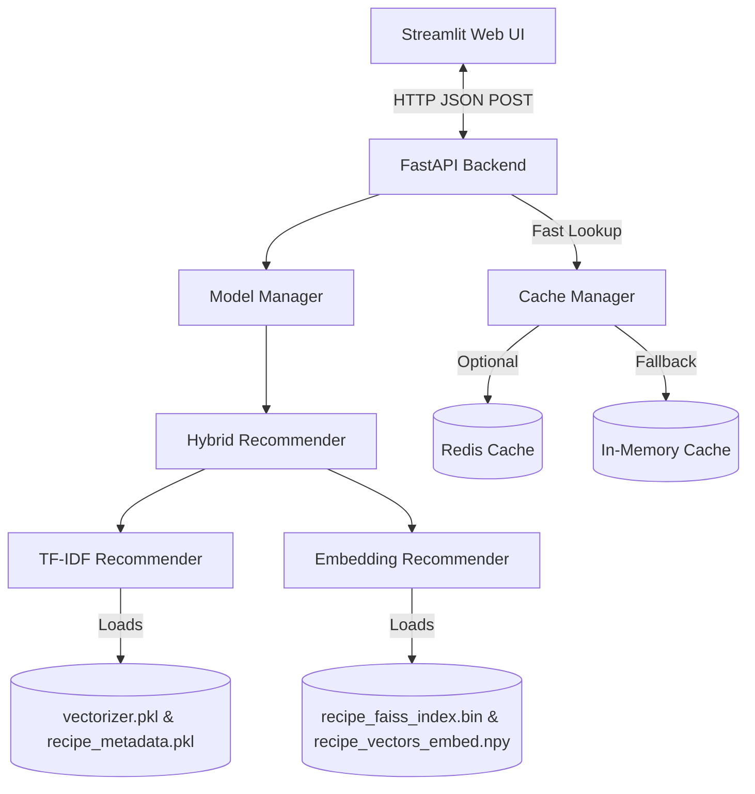

# 🏗️ QWAK System Architecture

QWAK is an AI-powered recipe recommendation system designed with a decoupled architecture, separating the core machine learning inference from the user interface. It combines classic text search techniques with state-of-the-art semantic sentence embeddings to deliver highly relevant recipe suggestions based on available ingredients.

---

## 🗺️ High-Level Component Overview

The application is split into three main components:
1. **Frontend (Streamlit)**: A responsive, user-friendly web interface that captures user ingredients, filter options, and handles real-time visual display.
2. **Backend (FastAPI)**: A high-performance ASGI web API serving recommendation endpoints, running ML models, handling request validation, caching, and health metrics.
3. **Training Pipeline (scikit-learn + Sentence-Transformers)**: An offline pipeline to clean raw recipe data, extract features, and export models (TF-IDF vectorizers and Sentence-BERT embeddings) to the backend.

---

## 🧠 Machine Learning & Recommendation Logic

QWAK uses a **Hybrid Scorer** to generate recommendations by merging two different similarity scores:

### 1. TF-IDF Recommender (Lexical Search)
* **How it works**: Represents recipe ingredients and query ingredients as sparse TF-IDF (Term Frequency-Inverse Document Frequency) vectors. It calculates the **cosine similarity** between the query and all recipe vectors.
* **Pros**: Excellent at finding exact ingredient matches (e.g., if you search for "quinoa", it strictly matches recipes containing the exact term "quinoa").
* **Score Weight**: Configured via `QWAK_TFIDF_WEIGHT` (defaults to `0.4`).

### 2. Embedding Recommender (Semantic Search)
* **How it works**: Uses a pre-trained Sentence-BERT model (`all-MiniLM-L6-v2`) to encode the list of ingredients into a 384-dimensional dense vector space. It runs a **FAISS** (Facebook AI Similarity Search) index search (using Inner Product similarity) to find the closest recipe vectors.
* **Pros**: Catches semantic relationships and culinary synonyms (e.g., if you search for "beef", it can match recipes containing "steak", "ground beef", or "chuck roast" even if the exact word "beef" is missing).
* **Score Weight**: Configured via `QWAK_EMBEDDING_WEIGHT` (defaults to `0.6`).

### 3. Hybrid Scoring Formula
When a recommendation request is received, both models run. For any recipe found, its final score is computed as:
$$\text{Match Score} = (W_{\text{tfidf}} \times S_{\text{tfidf}}) + (W_{\text{embed}} \times S_{\text{embed}})$$
Results are then sorted in descending order of the match score.

---

## ⚡ Caching Strategy

To handle high traffic and avoid redundant heavy vector operations (especially SBERT inference and FAISS search), the backend employs a multi-tiered caching strategy:

1. **Redis Cache (Tier 1)**: If a Redis server is running (defaulting to `localhost:6379`), recommendation results are cached with a configurable Time-To-Live (TTL) of 3600 seconds.
2. **In-Memory Cache (Tier 2/Fallback)**: If Redis is unavailable, the backend automatically logs a warning and falls back to a fast in-memory dictionary cache, ensuring high performance without requiring external services.

---

## 📋 Data Processing Lifecycle

1. **Raw CSV Input**: Raw recipes (containing `title`, `ingredients`, and optional metadata like `cuisine`, `difficulty`, and `cook_time`) are fed into the processor.
2. **Cleaning & Lemmatization (NLTK)**:
   * Stop ingredients (like `salt`, `water`, `oil`) are removed as they do not add recommendation value.
   * Measurement units (like `cups`, `grams`, `tbsp`) are stripped out.
   * Words are lemmatized to singular forms using the NLTK `WordNetLemmatizer` (e.g., "tomatoes" $\rightarrow$ "tomato").
3. **Model Generation**: The processed ingredients are vectorized (TF-IDF matrix) and encoded (SBERT vectors) and saved directly to the backend models folder.
